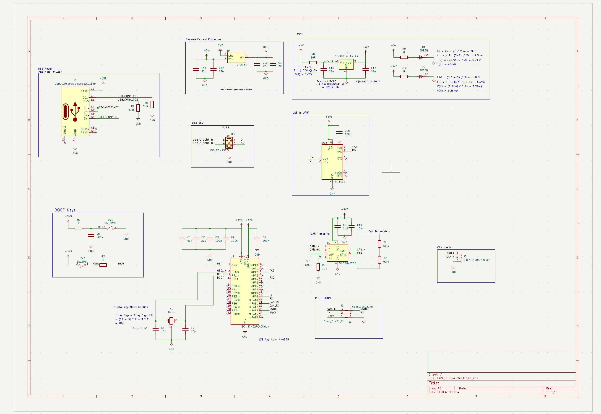
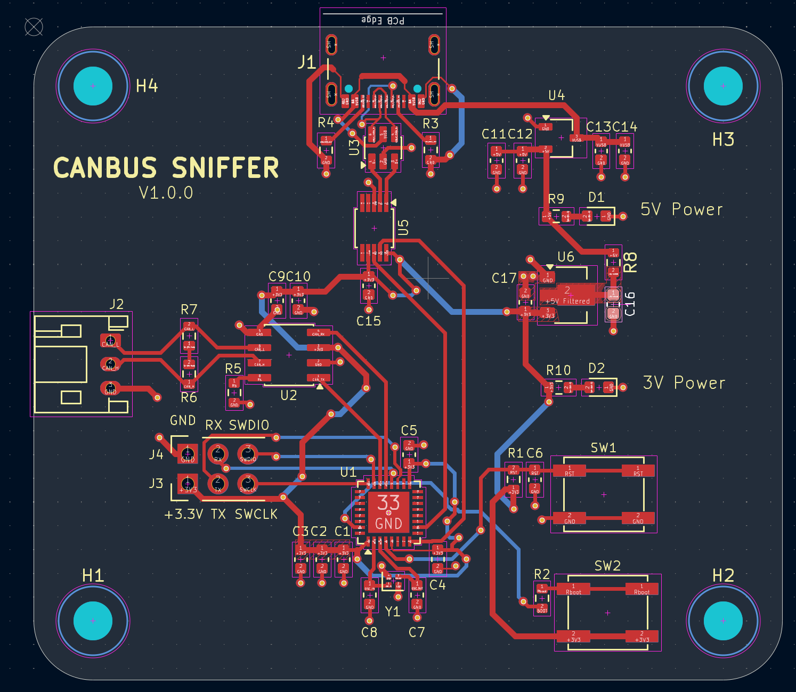
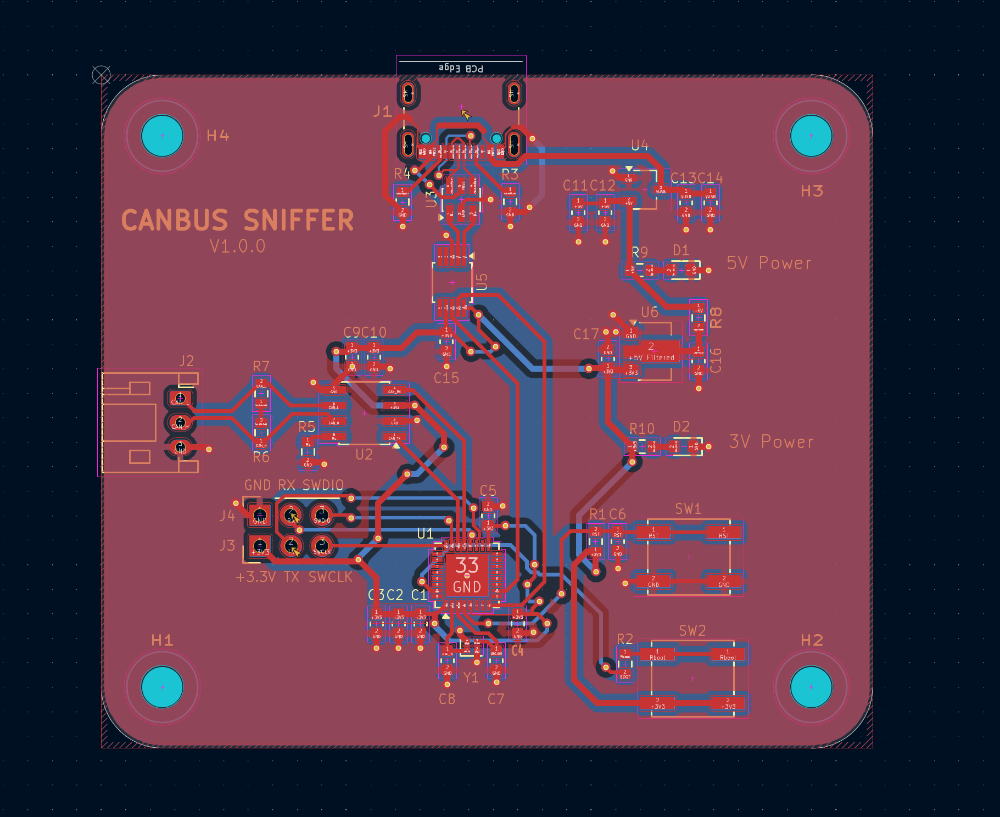
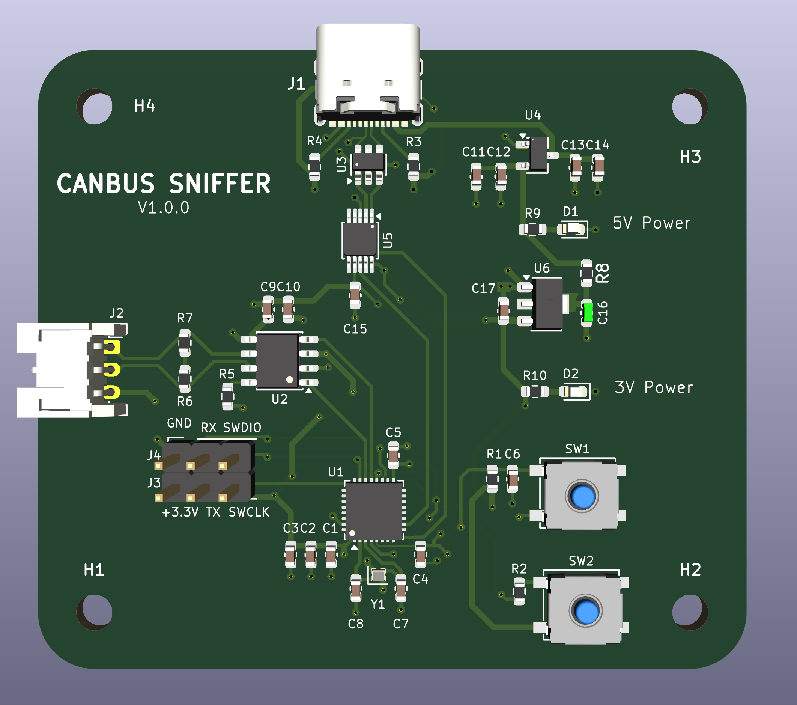
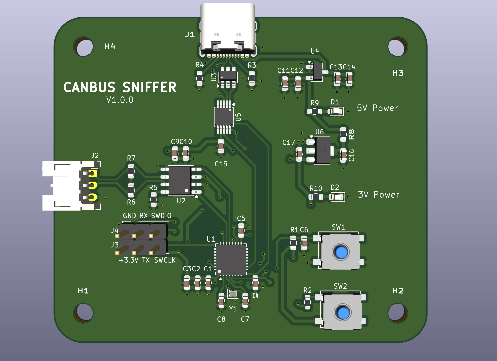

# CANBUS Sniffer PCB

A compact **USB-to-CAN Bus interface** designed around an **STM32F0 microcontroller** and a **CAN transceiver**. This project was built to practice professional PCB design techniques from schematic capture through PCB layout while following industry design practices.

**Version:** V1.0.0

---

# Overview

The goal of this project was to design a complete CAN Bus Sniffer PCB using KiCad while applying professional hardware engineering methodologies.

The board receives power over USB Type-C, regulates the voltage to 3.3V, communicates over a CAN transceiver, and provides an SWD interface for programming and debugging.

Rather than only creating a working PCB, this project focused heavily on layout quality, manufacturability, and signal integrity.

Topics practiced include:

- PCB floorplanning
- Component placement
- USB differential pair routing
- Controlled impedance routing
- Four-layer PCB stackup
- Power distribution
- Ground plane implementation
- Decoupling capacitor placement
- EMI reduction techniques
- Design Rule Checks (DRC)
- Design for Manufacturability (DFM)
- Design for Assembly (DFA)

---

# Features

- USB Type-C Interface
- STM32F0 Microcontroller
- CAN Bus Transceiver
- USB 2.0 Full-Speed Differential Pair
- 3.3V Linear Regulator
- TVS Protection
- Reverse Polarity Protection
- Power LEDs
- CAN Activity LEDs
- SWD Programming Header
- RESET Button
- BOOT Button
- Four Mounting Holes
- Four-Layer PCB

---

# Hardware Specifications

| Item | Specification |
|------|---------------|
| Microcontroller | STM32F0 Series |
| CAN Transceiver | SN65HVD230 Compatible |
| USB | USB Type-C (USB 2.0 Full Speed) |
| Input Voltage | 5V USB |
| Output Voltage | 3.3V |
| PCB Layers | 4 |
| PCB Thickness | 1.6 mm |
| USB Routing | Controlled Impedance Differential Pair |

---

# PCB Stackup

### Layer 1
- Components
- Signal Routing
- USB Differential Pair

### Layer 2
- Solid Ground Plane

### Layer 3
- Solid Ground Plane

### Layer 4
- Signal Routing
- Power Routing

Using two dedicated internal ground planes provides:

- Continuous return paths
- Reduced EMI
- Improved signal integrity
- Lower ground impedance
- Better high-frequency performance
- Improved power distribution

---

# Engineering Design Decisions

## USB Type-C

USB Type-C was selected for modern compatibility and ease of use.

USB CC pull-down resistors were implemented according to the USB Type-C specification to correctly identify the board as a USB device.

The USB D+ and D− lines were routed as a differential pair using KiCad's differential pair router.

Special attention was given to:

- Matched trace lengths
- Constant spacing
- Controlled impedance
- Minimal discontinuities
- Smooth routing
- Short path between the connector and downstream circuitry

---

## Differential Pair Routing

Although USB Full-Speed (12 Mbps) is more forgiving than USB High-Speed, the layout follows professional differential routing practices.

Design considerations included:

- Constant differential spacing
- Matched lengths
- 45° bends
- Minimal skew
- No unnecessary vias
- Short routing distance
- Continuous reference plane underneath the pair

---

## Power Architecture

Power flow:

USB Type-C

↓

Protection Circuit

↓

Filtering

↓

3.3V LDO

↓

STM32 + CAN Transceiver

Wide power traces were used where appropriate to reduce voltage drop and improve current handling.

---

## Power Integrity

Each power pin is locally decoupled with ceramic capacitors placed as close as possible to the corresponding IC supply pins.

This reduces:

- Supply noise
- Voltage ripple
- Transient voltage drops
- EMI

---

## Grounding Strategy

The board utilizes:

- Layer 2 Solid Ground Plane
- Layer 3 Solid Ground Plane
- Top Ground Pour
- Bottom Ground Pour
- Ground stitching vias

This creates low impedance return paths and improves signal integrity throughout the design.

The exposed thermal pad underneath the STM32 is connected directly into the internal ground planes through a thermal via.

---

## CAN Interface

The CAN transceiver converts the MCU CAN peripheral into differential CANH and CANL signals suitable for automotive communication.

The layout emphasizes:

- Short routing
- Clean return paths
- Differential signaling
- Noise immunity

---

## Crystal Oscillator

The crystal and its load capacitors were placed immediately adjacent to the MCU oscillator pins.

This minimizes:

- Loop area
- EMI susceptibility
- Clock jitter

---

## Component Placement

Components were grouped by function:

### USB Section

- USB Connector
- ESD Protection
- CC Resistors

### Power Section

- Protection
- LDO
- Filtering
- LEDs

### CAN Section

- CAN Connector
- CAN Transceiver
- Termination Components

### MCU Section

- STM32
- Crystal
- Decoupling
- Programming Header

Keeping functional blocks together improves routing quality and simplifies debugging.

---

# PCB Design Practices

The layout follows several common PCB design guidelines:

- Functional component grouping
- Short decoupling connections
- Short crystal routing
- Controlled impedance USB routing
- Wide power traces
- Ground stitching
- Clean routing
- Minimal unnecessary vias
- Four-layer stackup
- Continuous reference planes
- Full Design Rule Check verification

---

# Software Used

- KiCad 9
- STM32CubeMX
- STM32CubeIDE

---

# Images

## Schematic

<p align="center">

</p>

---

## PCB Layout

### Routed PCB

<p align="center">

</p>

### Routed PCB with Ground Pours

<p align="center">

</p>

---

## 3D PCB

### 3D Render

<p align="center">

</p>

### 3D Render with Ground Pours

<p align="center">

</p>

---

# Current Status

- ✅ Schematic Complete
- ✅ PCB Layout Complete
- ✅ Four-Layer PCB
- ✅ USB Differential Pair Routed
- ✅ Ground Planes Implemented
- ✅ Design Rule Check Passed
- ✅ 3D Model Generated
- ✅ GitHub Documentation Complete

---

# Future Improvements

- PCB Manufacturing
- Board Bring-up
- Firmware Development
- USB CDC Interface
- CAN Frame Decoder
- Desktop GUI
- Oscilloscope Validation
- Enclosure Design

---

# Lessons Learned

This project provided hands-on experience with:

- USB Type-C hardware implementation
- Controlled impedance routing
- Differential pair routing
- Four-layer PCB stackups
- Ground plane design
- Decoupling strategies
- CAN Bus hardware
- STM32 hardware design
- PCB floorplanning
- PCB routing techniques
- Power integrity
- Signal integrity
- Design Rule Checks (DRC)
- Design for Manufacturability (DFM)
- Design for Assembly (DFA)
- Professional hardware documentation using GitHub

---

# Repository Structure

```
CANBUS-Sniffer-PCB/
│
├── README.md
├── LICENSE
│
├── Hardware/
│   ├── CAN_BUS_sniffer.kicad_pro
│   ├── CAN_BUS_sniffer.kicad_sch
│   ├── CAN_BUS_sniffer.kicad_pcb
│   └── ...
│
├── images/
│   ├── schematic.png
│   ├── pcb_layout.png
│   ├── pcb_layout_w_gndpours.png
│   ├── pcb_3d.png
│   └── pcb_3d_w_gndpours.png
│
├── Manufacturing/
│
└── Firmware/
```

---

# License

This project is released under the **MIT License**.

---

**Designed by David Valle**

Electrical Engineer | PCB Design | Embedded Systems
